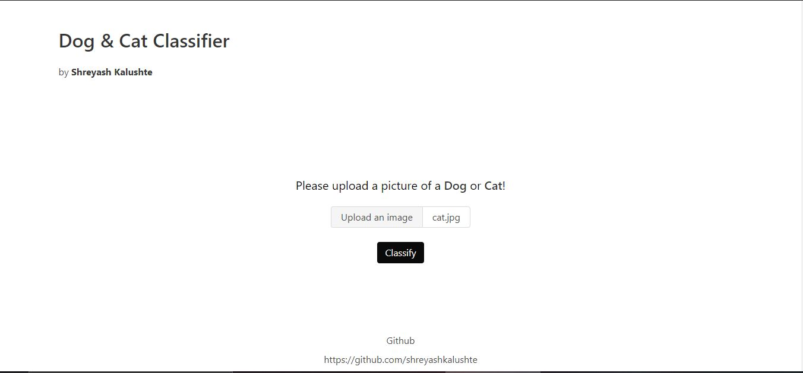
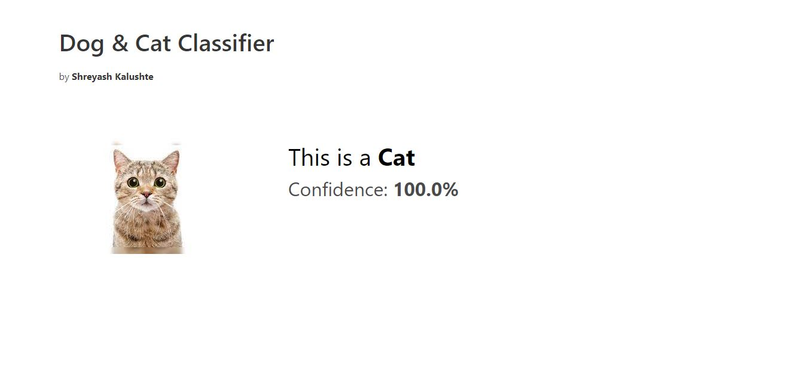
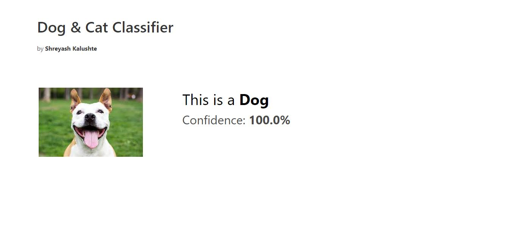

# Flask App Cat Dog Classifier using CNN

The problem Statement:-

Given a set of labeled images of cats and dogs, a machine learning model is to be learnt and later it is to be used to classify a set of new images as cats or dogs.

Classification of images between two class cat and dog using CNN with image augmentation .
We are using image augmentation to increase the amount of training data using augmentation by using from keras.preprocessing.image import ImageDataGenerator

Data - https://www.kaggle.com/c/dogs-vs-cats

<h2>Dependencies</h2>
• Jupyter notebook 
• Tensorflow 2.2.0 
• Python 3.6 
• Matplotlib 
• Pandas 
• Numpy  

First we build and train the model and save it. We then import this model into our flask application. So users can upload their photos and receive the prediction.

The model has the accuracy of 97.79 % for the train dataset and 97.32 % for the test dataset.

<h2>Homepage</h2>

Upload the image of a cat or dog.

<h2>Classification</h2>

The app then classifies the image also with displaying the confidence.

